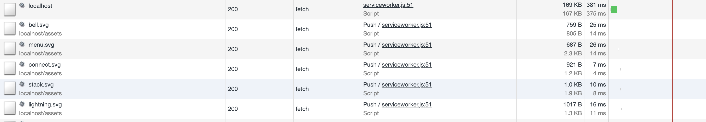

# HTTP2
## Сравнение рендеринга картинок
По ощущениям и визуально наиболее быстрым является inline картинки (из-за отсутствия необходимости в доп. запросе), однако у этого подхода есть минус - увеличение размера документа. С точки зрения пользователя - загрузки картинок не видно.

Стандартный вывод через src упирается в один полноценный rtt и визуально кажется, что картинки загружаются последовательно

При server-push ресурсы передаются c первым запросом, что позволяет избежать лишнего rtt, и существенно сокращает время загрузки и визуально кажется, что картинки загружаются параллельно и отрисовываются в один момент. По-сути, время тратится на поиск ресурса в push-кеше исходя из заголовков (https://habr.com/ru/company/badoo/blog/331216/)

Однако при грамотном кешировании принципиальной разницы между server-push и стандартным подходом нет - так как все будет упираться в кеш браузера.

## Аудит dev.to
https://www.webpagetest.org/result/190518_H1_b1463619c62c557ca58ff87f833861f1/1/performance_optimization/

Исходя из отчета можно увидеть, что есть крайне незначительная проблема с сжатием изображений (потенциальное уменьшение размера - 16,6 Кб) и кешированием статичных ресурсов. Ни одну из этих проблем не решит использование http2 и server-push в частности. Однако утверждать, что использование server-push не имеет смысла также нельзя, например, через него можно передвать картинки для layout. Необходимо более детальное тестирование с включенным http2
