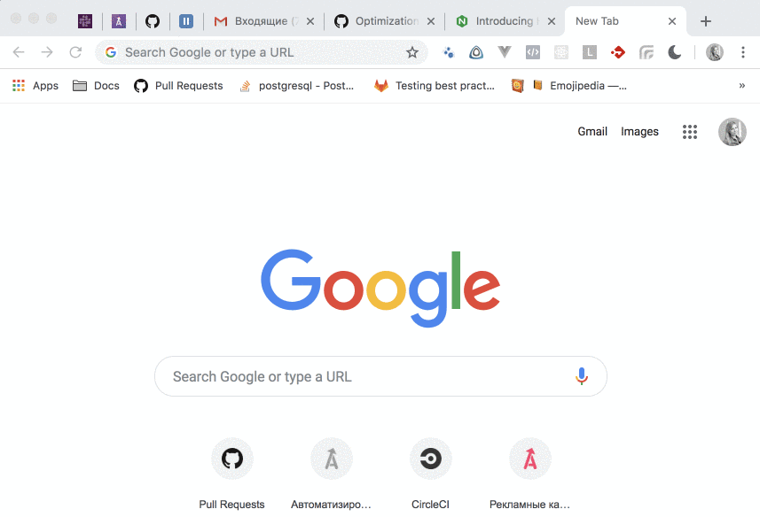
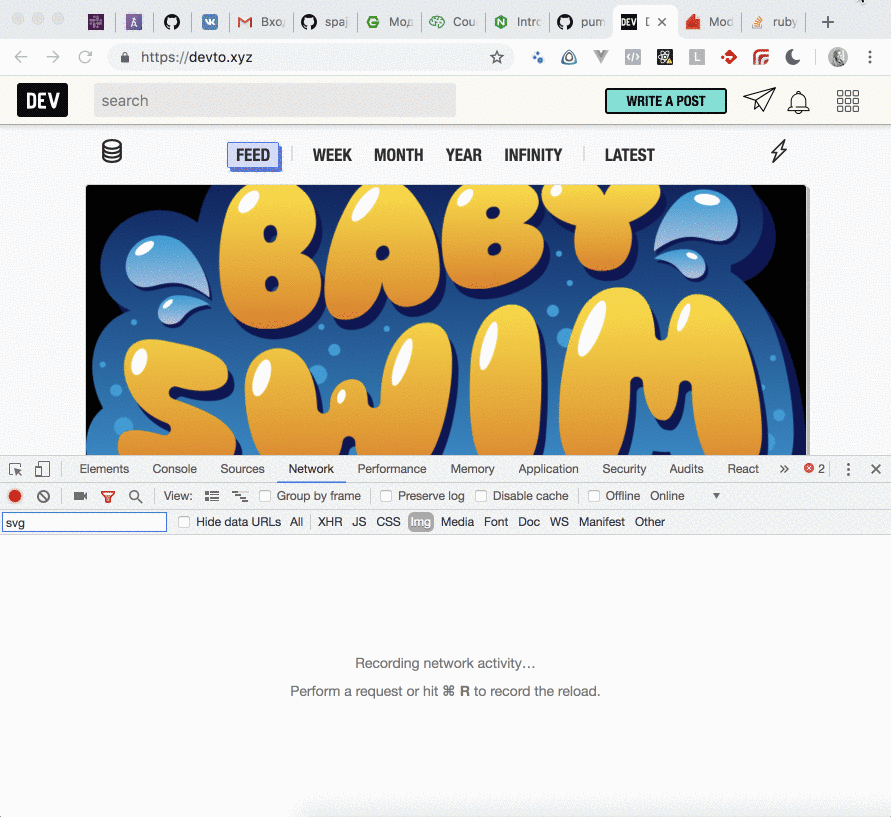

# Задание №5

### Шаг 1. Настроить сертификат для локального HTTPS

Получение сертификата с использованием `mkcert`:
```
$ brew install mkcert
$ brew install nss

$ mkcert -install
$ mkcert devto.xyz localhost 127.0.0.1 ::1

$ mv devto.xyz+3.pem /Users/annaselivanova/study/devto/cert/devto.xyz+3.pem
$ mv devto.xyz+3-key.pem /Users/annaselivanova/study/devto/cert/devto.xyz+3-key.pem
```

### Шаг 2. Настраиваем NGINX как reverse-proxy
Установить `NGINX`.
```
$ brew install nginx
```

Конфигурируем `NGINX`:
```
$ sudo nano /usr/local/etc/nginx/servers/devto_xyz.conf
```

Такой конфиг получился у меня:
```
upstream puma_devto {
  server unix:///tmp/devto.sock;
}

server {
  listen 80;
  server_name devto.xyz;
  return 301 https://$host$request_uri;
}

server {
  listen       443 ssl http2;
  server_name  devto.xyz;
  root         /Users/annaselivanova/study/devto/public;
  try_files    $uri/index.html $uri @puma_devto;

  ssl_certificate      /Users/annaselivanova/study/devto/cert/devto.xyz+3.pem;
  ssl_certificate_key  /Users/annaselivanova/study/devto/cert/devto.xyz+3-key.pem;
  ssl_session_timeout  5m;
  ssl_protocols TLSv1 TLSv1.1 TLSv1.2;
  ssl_ciphers 'ECDHE-RSA-AES128-GCM-SHA256:ECDHE-ECDSA-AES128-GCM-SHA256:ECDHE-RSA-AES256-G$
  ssl_prefer_server_ciphers   on;

  location ~ ^/(assets|packs)/ {
    gzip_static on;
    expires max;
    add_header Cache-Control public;
  }

  location @puma_devto {
    proxy_set_header X-Forwarded-For $proxy_add_x_forwarded_for;
    proxy_set_header Host $http_host;
    proxy_redirect off;
    proxy_set_header X-Forwarded-Proto https;
    proxy_pass http://puma_devto;
  }
}
```

Тут я добавила сразу директиву `gzip_static on;`, чтобы статические ассеты отдавались в сжатом виде.
В задании 3 я сделала компиляцию ассетов во время запуска приложения в режиме `local_production`:
 ```
$ bundle exec rake assers:precompile
 ```
при этом происходит их сжатие, поэтому они уже есть у нас в `*.gz`.

Запускам `NGINX`:
```
$ sudo nginx
```

Внесем изменения в `Procfile`, который используется для запуска приложения в 
`local_production` (см. [отчёт по заданию 3](https://github.com/spajic/task-3/pull/4)) – пуму биндим на unix сокет:
```
web: bundle exec puma -C config/puma.rb -e local_production -b unix:///tmp/devto.sock
```

Теперь запускаем проект в окружении `local_production`:
```
$ cd ~/study/devto
$ RAILS_ENV=local_production bin/startup
```

На этом шаге браузер успешно открывает `https://devto.xyz`:



### Шаг 3. Настроить HTTP/2 и server-push
Дополняем конфиг `NGinx` поддержкой `HTTP/2` и `server-push`.

```
server {
  listen  443 http2 ssl;
  ...

  location @puma_devto {
    ...
    http2_push_preload on;
  }
}
```

### Шаг 4. Поэксперементировать с HTTP/2 server-push
На главном экране `dev.to` есть ряд картинок.
Картинки из меню: `connect.svg`, `bell.svg`, `menu.svg` – заинлайнены.
Картинки `stack.svg` и `lightning.svg` – нет.

При перезагрузке страницы видно, что заинлайненные картинки редерятся сразу же вместе с загрузкой html, 
в то время как скачивание изображений `stack.svg` и `lightning.svg` начинается только после полной загрузки html.

Плюс инлайновых картинок в том, что иконки становятся видны пользователю сразу же при загрузке документа, 
не нужно ждать, чтобы начать пользоваться меню.
Минус – их размер несколько увеличивает размер документа. В данном случае это условный минус, потому что разница около 
килобайта кажется несущественной. Большие svg'хи, которые нужны как элементы декора, я бы инлайнить не стала. 
В данном случае уместно.

Теперь попробуем ради эксперимента отказаться от inline svg и добавить для картинок `server-push`.
Изменения см. здесь: https://github.com/foxy-eyed/task-3/pull/1
Поскольку ассеты, которые мы будем пушить, используются в сквозном `partial`'е шаблона, добавление соответствующих 
заголовков вынесла на уровень `ApplicationController` (для скорости добавила хук прямо там же, хотя, наверно, 
это не по фен-шую).

Проверка, что всё работает:


